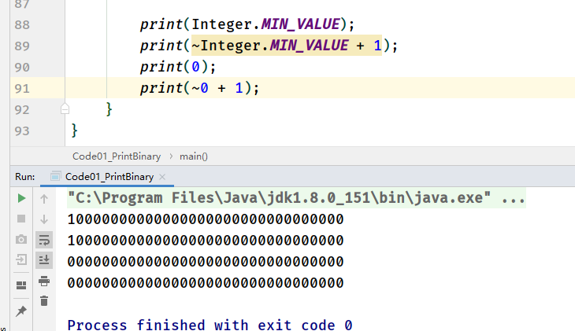

# Class01

# 1.位运算

## 1.1 位运算符

+ **<<**

>无符号左移
>
>用0填充

+ **">>"**

> 有符号右移
>
> 用1填充
>
> 负数的右移运算：
>
> 1. 把其正数的二进制取反+1，变成负数的二进制
>
> 2. 右移，用1补充
> 3. 二进制取反 ，加1

+ **">>>"**

> 无符号右移
>
> 用1填充

+ **&**

> "与"运算
>
> 都**有1才为1

+ **|**

> "或"运算
>
> 有1为1

+ **~**

> "非运算
>
> 0变1,1变0

## 2.2 相关知识点

1. **int 8字节，32位**

2. **取反 = 补码 = 反码加 + 1**

~~~java
		int a = 1;
        int b = -a;
        b = ~a + 1
~~~

3. **补码出现**

> 加法运算符： 正数加正数，还有负数加正数，这就涉及到了需要设计两套编程，而且加法是计算机最底层的计算，一个加法就设计两套分支，极大减低效率，为了能写一个编码流程，于是补码出现了
>
> 取反= 反码 + 1 即补码
>
> 非负数 = 非负数的非运算 + 1
>
> 使加法编程一套逻辑即可实现，不仅加法，加减乘除都适用

4. **int的范围**

> -2 ^ 31 ~ 2 ^ 31 - 1
>
> 减一的原因：负数和非负数平均分配，而0属于非负数里的，所以int的最大值要减1

5. **int 的负数最大值，0对应的非负数**

> 由 **4. int的范围** 引发，如果平均分配，0作为非负数，那么int中-2 ^ 31 就没有对应的非负数
>
> 计算后，还是其本身，此时可以考虑long类型

# 2. 排序

## 2.1 选择排序

## 2.2 冒泡排序

## 2.3 插入排序

