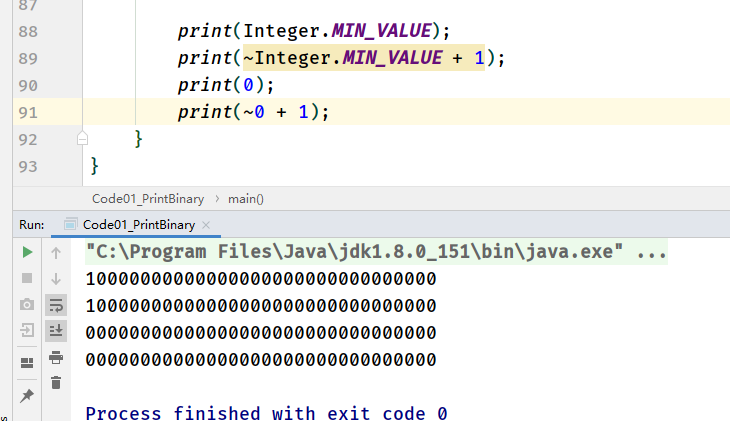
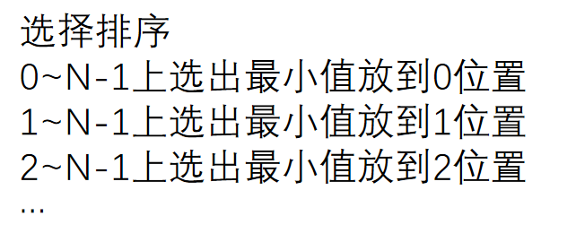
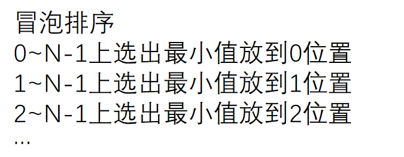
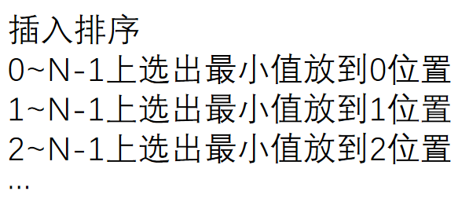

# Class01 位运算、算法是什么、简单排序

[TOC]

# 1.位运算

## 1.1 位运算符

+ **<<**

>无符号左移
>
>用0填充

+ **">>"**

> 有符号右移
>
> 用1填充
>
> 负数的右移运算：
>
> 1. 把其正数的二进制取反+1，变成负数的二进制
>
> 2. 右移，用1补充
> 3. 二进制取反 ，加1

+ **">>>"**

> 无符号右移
>
> 用1填充

+ **&**

> "与"运算
>
> 都**有1才为1

+ **|**

> "或"运算
>
> 有1为1

+ **~**

> "非运算
>
> 0变1,1变0

## 2.2 相关知识点

1. **int 4字节，32位**

2. **取反 = 补码 = 反码加 + 1**

~~~java
		int a = 1;
        int b = -a;
        b = ~a + 1
~~~

3. **补码出现**

> 加法运算符： 正数加正数，还有负数加正数，这就涉及到了需要设计两套编程，而且加法是计算机最底层的计算，一个加法就设计两套分支，极大减低效率，为了能写一个编码流程，于是补码出现了
>
> 取反= 反码 + 1 即补码
>
> 非负数 = 非负数的非运算 + 1
>
> 使加法编程一套逻辑即可实现，不仅加法，加减乘除都适用

4. **int的范围**

> -2 ^ 31 ~ 2 ^ 31 - 1
>
> 减一的原因：负数和非负数平均分配，而0属于非负数里的，所以int的最大值要减1

5. **int 的负数最大值，0对应的非负数**

> 由 **4. int的范围** 引发，如果平均分配，0作为非负数，那么int中-2 ^ 31 就没有对应的非负数
>
> 计算后，还是其本身，此时可以考虑long类型

# 2. 算法题：1! + 2! + 3! + ... + N!

> 给定一个参数N
>
> 返回1! + 2 ! +...N !的结果

## 2.1 Method1

> 1！，2！，3！...，N！各自算出相加

~~~java
	// factorial
    public static int factorial(int fc){
        int fcNum = 1;
        for (int i = 1; i <= fc; i++) {
            fcNum *= i;
        }
        return fcNum;
    }
    // Method1: 一个一个算
    public static int method1(int N){
        int result = 0;
        for (int i = 1; i <= N; i++) {
            result += factorial(i);
        }
        return result;
    }
~~~

## 2.2 Method2

> 1! = 1
>
> 2! = 1! * 2
>
> 3! = 2! * 3
>
> ...
>
> N! = (N-1)! * N

~~~java
	// Method2: 2! = 1!*2  3! = 2!*3 ... N! = (N-1)!*N
    public static int method2(int N){
        int result = 0;
        int cur = 1;
        for (int i = 1; i <= N; i++) {
            cur *= i;
            result += cur;
        }
        return result;
    }
~~~

# 2. 排序

+ 做题前，先考虑边界原则

+ 3个排序所用到的交换方法swap()

~~~java
	public static void swap(int[] arr, int i, int j){
        int temp = arr[i];
        arr[i] = arr[j];
        arr[j] = temp;
    }
~~~

## 2.1 选择排序

> 依次和第一个索引位置比较大小，在依次和第二个索引...直到第N个索引

~~~java
	// 选择排序
    public static void selectSort(int[] arr) {
        // 边界原则
        if (arr == null || arr.length < 2) {
            return;
        }
        // 缩小边界
        // 0~N-1 1~N-1 ...
        for (int i = 0; i < arr.length; i++) {
            int minValueIndex = i;
            // 和第i个逐一对比 j=i也对，交换的是0,0
            for (int j = i+1; j < arr.length; j++) {
                int num = arr[minValueIndex] > arr[j] ?  j : minValueIndex;
                swap(arr, i, num);
            }
        }
    }
~~~

## 2.2 冒泡排序

> 1. 每两个比较，把最小的数浮出冒泡
> 2. 每两个比较，把最大的数沉淀到底
>
> 这样第一个/最后一个就不用比较

1. 左神：

~~~java
	public static void bubbleSort3(int[] arr) {
        if (arr == null || arr.length < 2) {
            return;
        }
        int N = arr.length;
        for (int end = N - 1; end >= 0; end--) {
            for (int second = 1; second <= end; second++) {
                if (arr[second - 1] > arr[second]) {
                    swap(arr, second - 1, second);
                }
            }
        }
    }	
~~~

2. My

~~~java
	// 冒泡排序
    public static void bubbleSort1(int[] arr) {
        // 边界原则
        if (arr == null || arr.length < 2) {
            return;
        }
        // 缩小边界
        for (int i = arr.length - 1 ; i >= 0; i--) {
            for (int j = 1; j <= i; j++) {
                int num = arr[j-1] > arr[j] ? j : j-1;
                swap(arr, j-1, num);
            }
        }
    }
~~~

3. 和2逻辑一样

~~~java
	public static void bubbleSort2(int[] arr) {
        // 边界原则
        if (arr == null || arr.length < 2) {
            return;
        }
        // 缩小边界
        for (int i = arr.length - 1; i >= 0; i--) {
            for (int j = 0; j <= i-1; j++) {
                int num = arr[j] > arr[j+1] ? j+1 : j;
                swap(arr, j, num);
            }
        }
    }	

~~~

## 2.3 插入排序

> 一个数组分为2个部分，一个为有序部分，另一个为无序部分，无序部分第 i 个和有序部分依次比较
>
> 0索引不用自己比较，所以所1索引开始循环

1. 左神

~~~java
	public static void insertSort2(int[] arr) {
        if (arr == null || arr.length < 2) {
            return;
        }
        int N = arr.length;
        for (int end = 1; end < N; end++) {
            int newNumIndex = end;
            while (newNumIndex - 1 >= 0 && arr[newNumIndex - 1] > arr[newNumIndex]) {
                swap(arr, newNumIndex - 1, newNumIndex);
                newNumIndex--;
            }
        }
    }
~~~

2. 左神2.0

~~~java
	public static void insertSort3(int[] arr) {
        if (arr == null || arr.length < 2) {
            return;
        }
        for (int i = 1; i < arr.length; i++) {
            for (int pre = i - 1; pre >= 0 && arr[pre] > arr[pre + 1]; pre--) {
                swap(arr, pre, pre+1);
            }
        }
    }
~~~

3. My

~~~java
	// 插入排序
    public static void insertSort1(int[] arr) {
        // 边界原则
        if (arr == null || arr.length < 2) {
            return;
        }
        for (int i = 1; i < arr.length; i++) {
            for (int j = 0; j < i; j++) {
                int num = arr[j] < arr[i] ? j : i;
                swap(arr, j, num);
            }
        }
    }
~~~

4. 错的

~~~java
	// 错的
    public static void insertSort4(int[] arr) {
        // 边界原则
        if (arr == null || arr.length < 2) {
            return;
        }
        for (int i = 1; i < arr.length; i++) {
            for (int j = i - 1; j >= 0; j--) {
                int num = arr[j] < arr[i] ? j : i;
                swap(arr, j, num);
            }
        }
    }
~~~

### 插入排序总结

> 左神用的插入排序特别巧妙，从有序的 **有序《- ** 每两个比较
>
> 我：**有序—》**
>
> 差别： 左神用一个变量完成，我用了2个
>
> 第4个也是 **有序《-**，但是用一个数依次之间比较，如下
>
> 1,2,3,6,0
>
> 1,2,3,0,6
>
> 1,2,6,0,3
>
> 比较的时候是**有序向前的索引比较**，用一个索引的数依次和有序部分比较，该索引换完后，应该用换完后的索引继续向前比较
>
> 若**有序向后索引比较**，可用一个索引依次和依次比较，相当于从有序序列，从左往右找一个合适的地方插入，和左神的从右往左思想是一样的